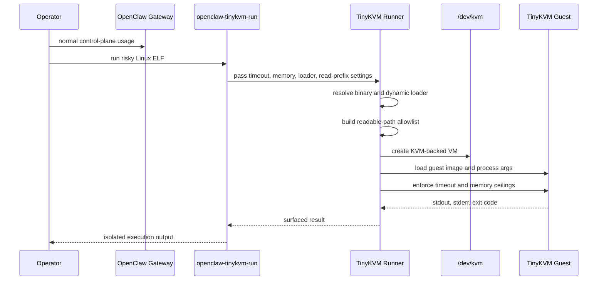

# TinyKVM Security Architecture

## Goal

This document explains how the Linux / TinyKVM path in this repository improves security compared with the older Dockerized Windows packaging path.

The short version is:

- OpenClaw stays on the Linux host
- high-risk executable workloads can be run under TinyKVM instead of directly on the host
- TinyKVM adds a hardware-virtualized execution boundary with explicit resource and file-read controls

This is a real security gain, but it is not yet a complete replacement for every OpenClaw sandbox path. The current upstream `openclaw` package still exposes Docker-centered sandbox configuration, so this repository uses TinyKVM as an explicit execution boundary rather than pretending it is an upstream-native sandbox backend.

## Security Objective

The objective is to reduce the blast radius of untrusted or semi-trusted Linux binaries that an operator chooses to execute as part of an OpenClaw-assisted workflow.

The design is aimed at these risks:

- accidental execution of hostile helper binaries
- malicious post-build tools in a local workspace
- prompt-driven operator mistakes that would otherwise run binaries directly on the host
- runaway processes that consume CPU or memory indefinitely

The design is not aimed at making the whole OpenClaw gateway untrusted-safe by itself. The gateway still runs on the host and remains part of the trusted control plane.

## Components

### Trusted control plane

- OpenClaw gateway running directly on Linux
- local OpenClaw config and credentials under `~/.openclaw`
- local Ollama endpoint, typically `http://127.0.0.1:11434`
- OpenClaw user-systemd hardening override from [scripts/Apply-OpenClawSystemdHardening.sh](/home/jonathan/src/claw/scripts/Apply-OpenClawSystemdHardening.sh)
- operator-managed scripts in [scripts/Install-OpenClawTinyKvmHost.sh](/home/jonathan/src/claw/scripts/Install-OpenClawTinyKvmHost.sh) and [scripts/Validate-OpenClawTinyKvmHost.sh](/home/jonathan/src/claw/scripts/Validate-OpenClawTinyKvmHost.sh)

### Isolated execution plane

- TinyKVM itself, built from upstream source by [scripts/Install-TinyKvmTooling.sh](/home/jonathan/src/claw/scripts/Install-TinyKvmTooling.sh)
- the local runner binary defined in [tinykvm-runner/openclaw_tinykvm_runner.cpp](/home/jonathan/src/claw/tinykvm-runner/openclaw_tinykvm_runner.cpp)
- the operator-facing wrapper [scripts/openclaw-tinykvm-run.sh](/home/jonathan/src/claw/scripts/openclaw-tinykvm-run.sh)

## Topology Diagram

```mermaid
flowchart TB
    operator[Operator]

    subgraph host[Trusted Linux Host]
        gateway[OpenClaw Gateway]
        config[OpenClaw Config and Credentials]
        ollama[Local Ollama]
        wrapper[openclaw-tinykvm-run]
        runner[openclaw-tinykvm-runner]
        kvm[/dev/kvm]
        workspace[Workspace Files]
    end

    subgraph guest[TinyKVM Guest Execution Plane]
        binary[Target Linux ELF]
        guestmem[Guest Memory]
        limits[Timeout and Memory Limits]
        fsview[Allowlisted File Reads]
    end

    operator --> gateway
    gateway --> ollama
    operator --> wrapper
    wrapper --> runner
    runner --> kvm
    runner --> guest
    runner --> workspace
    config --> gateway
    binary --> guestmem
    limits --> binary
    fsview --> binary
```

The key point in this diagram is that the gateway remains on the trusted host side, while the risky executable workload is pushed into the TinyKVM guest side.

## Trust Boundaries

### Boundary 1: gateway vs executable workload

OpenClaw remains outside TinyKVM. This matters because it keeps the gateway simple and avoids depending on unsupported upstream config hooks. It also means the host gateway is trusted and must be hardened independently.

In the current repository path, that host hardening is explicit rather than implied. The gateway installer applies a user-systemd drop-in that enables controls such as:

- `NoNewPrivileges=yes`
- `PrivateTmp=yes`
- `PrivateDevices=yes`
- `ProtectKernelModules=yes`
- `ProtectKernelTunables=yes`
- `ProtectControlGroups=yes`
- `ProtectClock=yes`
- `ProtectHostname=yes`
- `LockPersonality=yes`
- `RestrictSUIDSGID=yes`
- `ProtectProc=invisible`
- `ProcSubset=pid`
- `ProtectSystem=full`

Those controls do not make the gateway untrusted-safe, but they do reduce the host-side attack surface if the gateway process or one of its child processes is abused.

### Boundary 2: host kernel vs TinyKVM guest

TinyKVM runs Linux userspace programs using KVM-backed virtualization. That introduces a stronger execution boundary than just spawning the binary directly as a normal host process.

The guest gets:

- its own guest memory space
- execution timeout handling
- explicit memory limits
- a constrained file-read policy via TinyKVM callbacks in the runner

### Boundary 3: guest filesystem view vs host filesystem

The current runner does not expose arbitrary host file access. It uses `set_open_readable_callback` to allow read access only to selected prefixes plus the target program and required loader/library paths.

In the current implementation, the allowlist starts with:

- the current workspace root
- the target program directory
- standard library locations such as `/lib` and `/usr/lib`
- `/etc`
- any operator-supplied extra prefixes

This is narrower than “host process can open anything the user can open,” which is the default risk without TinyKVM.

## How TinyKVM Adds Security

### 1. Hardware-virtualized execution instead of direct host exec

The biggest gain is that the target binary is not executed as a regular host process in the same runtime model as the gateway. TinyKVM places that execution inside a KVM-backed guest environment.

That reduces the direct attack surface between the guest binary and the host userspace process model.

### 2. Resource exhaustion controls

The runner sets explicit limits for:

- maximum guest memory
- maximum copy-on-write working memory
- maximum execution time

That gives the operator a default answer to obvious denial-of-service cases such as:

- infinite loops
- pathological allocators
- programs that never return

Without TinyKVM, those protections would have to be recreated with host-side wrappers and would still run in the host process model.

### 3. Narrower file-read surface

The runner only allows guest file opens inside configured prefixes. This means a guest program is not automatically granted the full host-readable filesystem.

That matters because many malicious or buggy binaries do not need write access to be damaging; broad read access alone can expose:

- source trees
- secrets in project directories
- local credentials
- machine-specific configuration

The allowlist model is not perfect, but it is materially better than unrestricted host execution.

### 4. Better operator intent boundaries

The wrapper creates an explicit “this workload is untrusted enough to isolate” path. That changes the operator workflow from:

- `./program`

to:

- `openclaw-tinykvm-run ./program`

That distinction is operationally important. It gives humans and automation a separate security lane for risky code.

## Execution Flow

1. The operator installs OpenClaw on the host with [scripts/Install-OpenClawTinyKvmHost.sh](/home/jonathan/src/claw/scripts/Install-OpenClawTinyKvmHost.sh).
2. That script configures the gateway for local Linux use, binds it to loopback, sets token auth, and disables OpenClaw’s Docker sandbox mode.
3. The installer applies a user-systemd hardening override so the host gateway process does not run with the default service surface.
4. The operator installs TinyKVM tooling with [scripts/Install-TinyKvmTooling.sh](/home/jonathan/src/claw/scripts/Install-TinyKvmTooling.sh).
5. When a Linux ELF should run with added isolation, the operator uses [scripts/openclaw-tinykvm-run.sh](/home/jonathan/src/claw/scripts/openclaw-tinykvm-run.sh).
6. The wrapper launches the TinyKVM runner, which:
   - loads the program
   - detects whether it is dynamically linked
   - resolves the guest loader when needed
   - applies memory and timeout settings
   - restricts readable paths
   - executes the binary inside TinyKVM

## Execution Diagram



This flow highlights that the decision to isolate is explicit. The operator does not rely on an implicit upstream sandbox backend; the wrapper is the handoff point into the TinyKVM boundary.

## Threat Path Diagram

```mermaid
flowchart LR
    binary[Untrusted or Semi-Trusted Binary]

    subgraph controls[Security Controls]
        execBoundary[TinyKVM Execution Boundary]
        timeoutCtrl[Execution Timeout]
        memCtrl[Memory and COW Limits]
        readCtrl[Readable Path Allowlist]
    end

    subgraph assets[Protected Host Assets]
        gatewayAsset[OpenClaw Gateway Process]
        secretsAsset[OpenClaw Config and Secrets]
        fsAsset[Host Filesystem Outside Allowlist]
        stabilityAsset[Host Stability]
    end

    binary --> execBoundary
    binary --> timeoutCtrl
    binary --> memCtrl
    binary --> readCtrl

    execBoundary -. reduces direct host-process exposure .-> gatewayAsset
    readCtrl -. blocks arbitrary reads .-> fsAsset
    readCtrl -. reduces secret exposure .-> secretsAsset
    timeoutCtrl -. limits hangs .-> stabilityAsset
    memCtrl -. limits resource exhaustion .-> stabilityAsset
```



This diagram is the practical security story in one picture: TinyKVM does not make the gateway disappear, but it puts controls in front of the most obvious host-compromise and host-exhaustion paths for risky executable workloads.

## Security Properties We Rely On

- `/dev/kvm` is present and only usable by appropriately trusted local users.
- OpenClaw gateway is bound to loopback and protected with token auth.
- OpenClaw gateway runs under an applied user-systemd hardening override rather than the unmodified generated service.
- Operators choose the TinyKVM path for binaries that deserve isolation.
- The TinyKVM runner allowlist remains narrow and is not turned into a blanket host-filesystem escape hatch.

## What This Does Not Yet Protect

This design does not currently provide:

- transparent interception of every OpenClaw tool execution
- a native upstream `openclaw` sandbox backend powered by TinyKVM
- a complete outbound network policy for guest binaries
- a complete mediation layer for all host writes
- protection against a fully compromised host gateway process

Those are important limits. The current design adds a meaningful execution boundary for selected workloads, but it does not transform the whole product into a fully compartmentalized zero-trust agent runtime.

## Why This Is Still Worth Doing

Even with those limits, TinyKVM improves the security story in three practical ways:

- it replaces direct host execution with hardware-virtualized execution for chosen binaries
- it gives resource ceilings that are hard to ignore operationally
- it makes filesystem exposure explicit and auditable in code

The additional host hardening in this repository matters because TinyKVM only protects the execution plane. The OpenClaw gateway remains part of the trusted control plane, so binding it to loopback, enforcing token auth, and shrinking the default service attack surface are necessary complements to the TinyKVM boundary rather than optional polish.

That is a stronger and more defensible architecture than “run the gateway in Docker and hope that covers every risky execution path.”

## Hardening Recommendations

- Keep `gateway.bind=loopback`.
- Keep gateway token auth enabled.
- Use TinyKVM only on Linux hosts where `/dev/kvm` access is limited to trusted operators.
- Treat [scripts/openclaw-tinykvm-run.sh](/home/jonathan/src/claw/scripts/openclaw-tinykvm-run.sh) as the default path for untrusted local binaries.
- Keep `OPENCLAW_TINYKVM_EXTRA_READ_PREFIXES` as narrow as possible.
- On non-FHS hosts, add only the specific loader and library roots required for execution.
- Do not describe this as a full OpenClaw sandbox backend until upstream supports that integration model directly.
