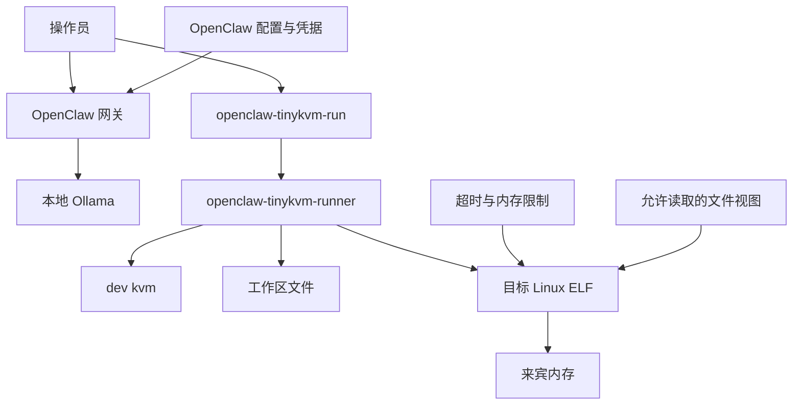
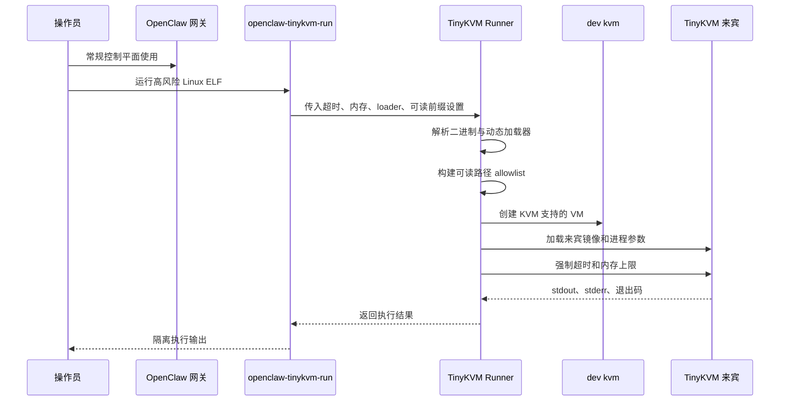
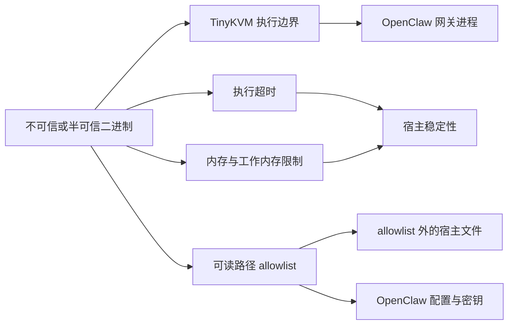

# TinyKVM 安全架构

[English](tinykvm-security-architecture.md)

## 目标

本文说明本仓库中的 Linux / TinyKVM 路径，如何相比旧的 Windows Docker 化打包路径带来更好的安全性。

简要结论：

- OpenClaw 仍留在 Linux 宿主机上
- 高风险可执行负载可以在 TinyKVM 下运行，而不是直接在宿主上运行
- TinyKVM 提供硬件虚拟化执行边界，并带有显式的资源控制与文件读取控制

这确实带来了安全增益，但它还不是所有 OpenClaw 沙箱路径的完整替代品。当前上游 `openclaw` 包仍然暴露以 Docker 为中心的沙箱配置，因此本仓库把 TinyKVM 当作显式执行边界，而不是假装它已经是上游原生沙箱后端。

## 安全目标

目标是降低这样一类风险的爆炸半径：运维人员在 OpenClaw 辅助流程中选择执行的不可信或半可信 Linux 二进制。

该设计面向以下风险：

- 误执行恶意辅助二进制
- 本地工作区中的恶意构建后工具
- 由提示驱动导致的人为误操作，否则这些程序会直接在宿主上运行
- 无限占用 CPU 或内存的失控进程

该设计并不试图把整个 OpenClaw 网关本身变成“无需信任也安全”的组件。网关仍运行在宿主上，依然属于可信控制平面。

## 组件

### 可信控制平面

- 直接运行在 Linux 上的 OpenClaw 网关
- 位于 `~/.openclaw` 下的本地 OpenClaw 配置与凭据
- 本地 Ollama 端点，通常是 `http://127.0.0.1:11434`
- 来自 [scripts/Apply-OpenClawSystemdHardening.sh](../scripts/Apply-OpenClawSystemdHardening.sh) 的 OpenClaw user-systemd 加固覆盖
- 位于 [scripts/Install-OpenClawTinyKvmHost.sh](../scripts/Install-OpenClawTinyKvmHost.sh) 和 [scripts/Validate-OpenClawTinyKvmHost.sh](../scripts/Validate-OpenClawTinyKvmHost.sh) 中的运维脚本

### 隔离执行平面

- 由 [scripts/Install-TinyKvmTooling.sh](../scripts/Install-TinyKvmTooling.sh) 从上游源码构建的 TinyKVM
- 在 [tinykvm-runner/openclaw_tinykvm_runner.cpp](../tinykvm-runner/openclaw_tinykvm_runner.cpp) 中定义的本地 runner 二进制
- 面向运维者的包装器 [scripts/openclaw-tinykvm-run.sh](../scripts/openclaw-tinykvm-run.sh)

## 拓扑图

关键点是：网关仍位于可信宿主侧，而高风险可执行工作负载被推入 TinyKVM 来宾侧。

## 信任边界

### 边界 1：网关 与 可执行负载

OpenClaw 保持在 TinyKVM 外部。这很重要，因为它让网关保持简单，并避免依赖上游不支持的配置钩子。同时也意味着宿主网关本身仍然是可信组件，必须单独加固。

在当前仓库路径中，这种加固是显式的，而不是默认存在。网关安装器会应用 user-systemd drop-in，启用如下控制：

- `NoNewPrivileges=yes`
- `PrivateTmp=yes`
- `PrivateDevices=yes`
- `ProtectKernelModules=yes`
- `ProtectKernelTunables=yes`
- `ProtectControlGroups=yes`
- `ProtectClock=yes`
- `ProtectHostname=yes`
- `LockPersonality=yes`
- `RestrictSUIDSGID=yes`
- `ProtectProc=invisible`
- `ProcSubset=pid`
- `ProtectSystem=full`

这些控制不会把网关变成“无需信任也安全”的进程，但会在网关进程或其子进程被滥用时降低宿主侧攻击面。

### 边界 2：宿主内核 与 TinyKVM 来宾

TinyKVM 通过 KVM 支持的虚拟化来运行 Linux 用户态程序。这比把二进制作为普通宿主进程直接启动要强得多。

来宾获得：

- 独立的来宾内存空间
- 执行超时处理
- 显式内存限制
- 通过 runner 回调实现的受限文件读取策略

### 边界 3：来宾文件系统视图 与 宿主文件系统

当前 runner 不会暴露任意宿主文件访问。它通过 `set_open_readable_callback` 仅允许读取选定前缀、目标程序本身以及所需的 loader/library 路径。

在当前实现中，allowlist 初始包括：

- 当前工作区根目录
- 目标程序目录
- `/lib`、`/usr/lib` 等标准库路径
- `/etc`
- 运维者额外指定的前缀

这比“宿主进程可以打开用户能打开的任何文件”更窄，而后者正是没有 TinyKVM 时的默认风险。

## TinyKVM 如何提升安全性

### 1. 用硬件虚拟化执行替代直接宿主执行

最大收益在于：目标二进制不会以普通宿主进程的方式、在与网关相同的运行模型中执行。TinyKVM 把这段执行放进 KVM 支持的来宾环境。

这降低了来宾二进制与宿主用户态模型之间的直接攻击面。

### 2. 资源耗尽控制

runner 会设置明确限制：

- 最大来宾内存
- 最大 copy-on-write 工作内存
- 最大执行时间

这为明显的拒绝服务场景提供了默认控制，例如：

- 死循环
- 异常分配器
- 永不返回的程序

如果没有 TinyKVM，这些保护只能通过宿主包装器重建，而且仍然运行在宿主进程模型中。

### 3. 更窄的文件读取面

runner 只允许来宾在配置前缀内打开文件。也就是说，来宾程序不会天然获得整个宿主可读文件系统。

这很重要，因为许多恶意或有缺陷的二进制即使不具备写权限，也可能造成伤害；仅广泛读取权限就可能暴露：

- 源代码树
- 项目目录中的密钥
- 本地凭据
- 机器特定配置

allowlist 模型并不完美，但它明显优于“无限制宿主执行”。

### 4. 更清晰的运维意图边界

包装器提供了一条显式的“该负载足够不可信，需要隔离”的执行路径。运维流程从：

- `./program`

变为：

- `openclaw-tinykvm-run ./program`

这个区别在操作层面很重要。它给人工和自动化都提供了一条专门的安全执行通道。

## 执行流程

1. 运维者用 [scripts/Install-OpenClawTinyKvmHost.sh](../scripts/Install-OpenClawTinyKvmHost.sh) 在宿主机上安装 OpenClaw。
2. 该脚本为本地 Linux 使用配置网关，绑定 loopback、设置 token 认证，并关闭 OpenClaw 的 Docker 沙箱模式。
3. 安装器会应用 user-systemd 加固覆盖，避免宿主网关以默认服务面运行。
4. 运维者用 [scripts/Install-TinyKvmTooling.sh](../scripts/Install-TinyKvmTooling.sh) 安装 TinyKVM 工具。
5. 当某个 Linux ELF 需要增加隔离时，运维者使用 [scripts/openclaw-tinykvm-run.sh](../scripts/openclaw-tinykvm-run.sh)。
6. 该包装器启动 TinyKVM runner，runner 会：
   - 加载程序
   - 判断是否为动态链接
   - 在需要时解析来宾 loader
   - 应用内存与超时设置
   - 限制可读取路径
   - 在 TinyKVM 内执行二进制

## 执行图

这里强调的是：隔离是显式决策。运维者并不依赖一个假想的上游沙箱后端，而是通过包装器进入 TinyKVM 边界。

## 威胁路径图

这一图概括了实际安全故事：TinyKVM 不会让网关消失，但它会在高风险可执行工作负载面前加入明确控制，降低宿主妥协和资源耗尽风险。

## 我们依赖的安全属性

- `/dev/kvm` 存在，并且只有足够可信的本地用户可以使用
- OpenClaw 网关绑定到 loopback，并启用了 token 认证
- OpenClaw 网关运行在已应用的 user-systemd 加固覆盖之下，而不是默认生成的服务
- 运维者会为值得隔离的二进制主动选择 TinyKVM 路径
- TinyKVM runner 的 allowlist 保持收敛，不会演变成通向整个宿主文件系统的逃逸口

## 当前尚未保护的内容

该设计目前并不提供：

- 对所有 OpenClaw 工具执行的透明拦截
- 由 TinyKVM 驱动的上游原生 `openclaw` 沙箱后端
- 面向来宾二进制的完整出站网络策略
- 面向所有宿主写操作的完整中介层
- 对已完全被攻陷的宿主网关进程的保护

这些限制很重要。当前设计确实为选定工作负载增加了有意义的执行边界，但它并没有把整个产品变成完全隔离的零信任代理运行时。

## 为什么仍然值得做

即使有这些限制，TinyKVM 仍以三种实际方式改善安全性：

- 它把选定二进制的直接宿主执行替换为硬件虚拟化执行
- 它提供了不容易被忽视的资源上限
- 它让文件系统暴露在代码中变得显式且可审计

本仓库中的额外宿主加固同样重要，因为 TinyKVM 只保护执行平面。OpenClaw 网关仍是可信控制平面的一部分，因此 loopback 绑定、token 认证和缩小默认服务攻击面是 TinyKVM 边界的必要补充，而不是可有可无的修饰。

这比“把网关放进 Docker 然后希望它能覆盖所有高风险执行路径”的说法更强，也更站得住脚。

## 加固建议

- 保持 `gateway.bind=loopback`
- 保持网关 token 认证启用
- 仅在 `/dev/kvm` 访问限制给可信操作员的 Linux 宿主上使用 TinyKVM
- 将 [scripts/openclaw-tinykvm-run.sh](../scripts/openclaw-tinykvm-run.sh) 作为不可信本地二进制的默认执行路径
- 保持 `OPENCLAW_TINYKVM_EXTRA_READ_PREFIXES` 尽可能窄
- 在非 FHS 宿主上，只加入执行所需的特定 loader 和库路径
- 在上游直接支持之前，不要把这描述成完整的 OpenClaw 原生沙箱后端
